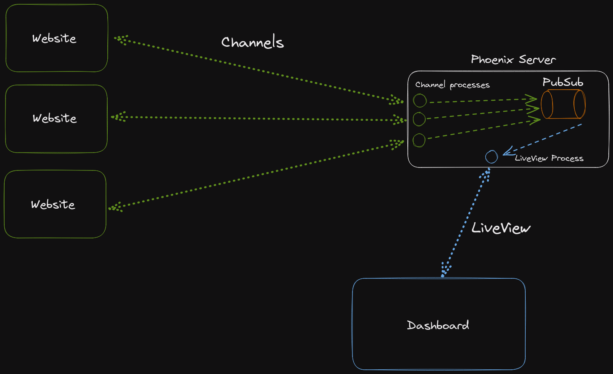

# phoenix.aayushsahu.com (aka Accumulator)

Accumulator es una aplicación de productividad personal y seguimiento de datos construida con Elixir/Phoenix. Sirve como una plataforma unificada para diversas utilidades personales y servicios de recopilación de datos.

## Características

### Panel de control
- Rastrea estadísticas de visitantes del sitio web/blog en tiempo real
- Muestra los espectadores actuales de la página usando Phoenix Presence
- Ordena y organiza los datos analíticos del blog
- Monitorea los conteos de visitas a páginas en [mi sitio web](https://aayushsahu.com)

### Sistema de notas
- Crea y organiza notas en espacios de trabajo
- Capacidades de compartición pública/privada
- Soporte para Markdown
- Funcionalidad de búsqueda
- Organización basada en fechas

### Repositorio de fragmentos de texto (Paste Bin)
- Crea fragmentos de texto/pegados privados
- Establece tiempos de expiración
- Soporte para adjuntar archivos
- Limpieza automática de pegados expirados

### Integración con Spotify
- Muestra la canción que se está reproduciendo actualmente
- Muestra las canciones y artistas más populares
- Actualiza los datos automáticamente en intervalos programados

### Gestión de plantas
- Sigue los horarios de riego de las plantas de interior
- Recibe notificaciones para las plantas que necesitan riego
- Almacena detalles de las plantas e instrucciones de cuidado

### Autenticación
- Sistema de autenticación de usuarios seguro
- Rutas protegidas para datos privados

## Arquitectura

- Construido con Elixir y Phoenix LiveView
- PostgreSQL para la persistencia de datos
- Phoenix PubSub para actualizaciones en tiempo real
- Phoenix Presence para rastrear usuarios activos
- Tareas programadas usando trabajadores periódicos
- Agrupación distribuida de Elixir con libcluster

## Configuración local

Requisitos: Elixir, PostgreSQL.

Esta aplicación utiliza PostgreSQL. Puedes instalarla manualmente o a través de Docker. Si el puerto es diferente, debes realizar cambios en el archivo `config/dev.exs`.

Para iniciar tu servidor Phoenix:

- Clona el repositorio
- Crea un archivo `.env` con las variables de entorno necesarias (consulta `.env.example` si está disponible)
- Ejecuta `mix setup` para instalar y configurar las dependencias
- Inicia el endpoint de Phoenix con `mix phx.server` o dentro de IEx con `iex -S mix phx.server`

Ahora puedes visitar [`localhost:4000`](http://localhost:4000) desde tu navegador.

## Despliegue

Esta aplicación está configurada para su despliegue en Fly.io utilizando el archivo `fly.toml` y `Dockerfile` incluidos.

## Arquitectura del sistema

La aplicación utiliza Phoenix PubSub y Presence para características en tiempo real:

1. **Recopilación de datos**: Varios endpoints recopilan datos (visitas al sitio web, reproducciones de Spotify, etc.)
2. **Almacenamiento**: Los datos se almacenan en PostgreSQL
3. **Actualizaciones en tiempo real**: Cuando los datos cambian, los mensajes de PubSub notifican a los componentes relevantes
4. **LiveView**: Phoenix LiveView asegura que la interfaz de usuario siempre esté sincronizada con los datos más recientes
5. **Actualizaciones programadas**: Las tareas en segundo plano actualizan regularmente los datos externos (Spotify, etc.)

### Flujo del panel de control

Todos los datos se almacenan en Postgres. La primera renderización muestra datos ficticios. Tan pronto como se establece una conexión de LiveView, obtenemos los datos de Postgres y la cantidad de usuarios actuales (usando Presence) y actualizamos el cliente. LiveView también se suscribe (a través de Phoenix PubSub) a un tema particular (con el prefijo "update:") para recibir algunas actualizaciones.

Cada vez que se actualizan los datos (un nuevo usuario visita mi sitio web/blog), enviamos un mensaje de PubSub a ese tema "update:<topic>". El LiveView recibe un mensaje en este tema, obtiene los datos más recientes de Postgres y el conteo de Presence, y actualiza el LiveView.

Vista general de cómo encaja todo:

