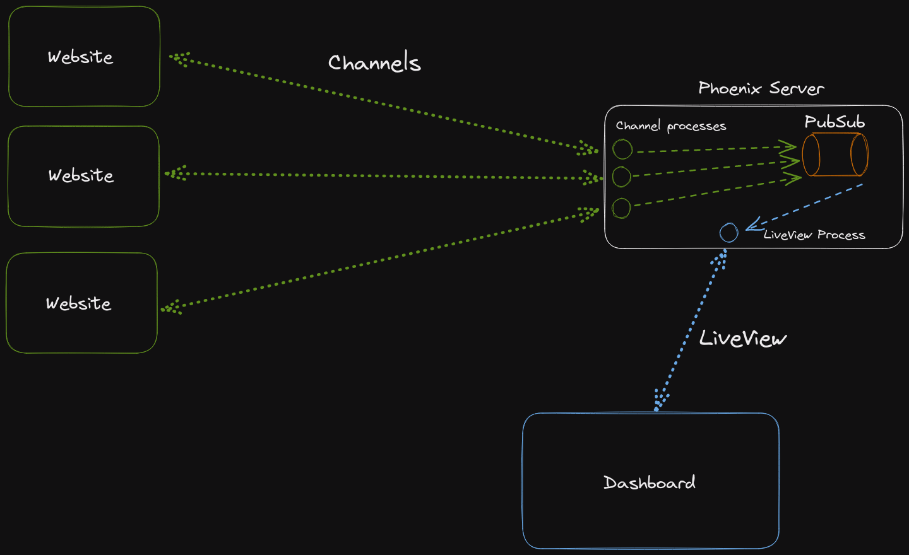

# phoenix.aayushsahu.com

Internally called **Accumulator**

## Local Setup

This application uses Redis. You can either install it manually or through docker. Your redis instance should run on Port 6379(default). If the port is different, you need to make changes to the `config/dev.exs` file.

```bash
# Redis docker setup
docker network create -d bridge redisnet
docker run -d -p 6379:6379 --network redisnet redis
```

Make sure you have elixir installed.

To start your Phoenix server:

- Clone the repo
- Run `mix setup` to install and setup dependencies
- Start Phoenix endpoint with `mix phx.server` or inside IEx with `iex -S mix phx.server`

Now you can visit [`localhost:4000`](http://localhost:4000) from your browser.

Ready to run in production? Please [check our deployment guides](https://hexdocs.pm/phoenix/deployment.html).

## Learn more

- Official website: https://www.phoenixframework.org/
- Guides: https://hexdocs.pm/phoenix/overview.html
- Docs: https://hexdocs.pm/phoenix
- Forum: https://elixirforum.com/c/phoenix-forum
- Source: https://github.com/phoenixframework/phoenix

## TODO:

Future:

- Move dashboard data into stream(currently stream doesn't support filtering, sorting, etc without being hacky)

## Internals

### Dashboard

All the data is stored on redis. The first render shows dummy data. As soon as liveview connection is established, we fetch data from redis, and current user on the website count(using Presence) and update the client. Liveview also subscribes(through Phoenix PubSub) to a particular topic(with "update:" prefix) to get some updates.

Whenever data is updated(a new user visits my website/blog), we send a pubsub message to a that "update:<topic>" topic. The liveview gets a message on this topic, fetches latest data from redis and presence count, and updates the liveview.

High overview on how everything fits together:



## TODO:

- Think about settings up a "demo" page for view only access